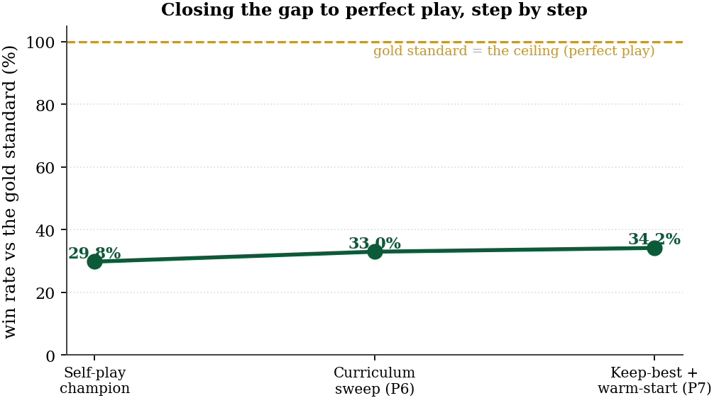
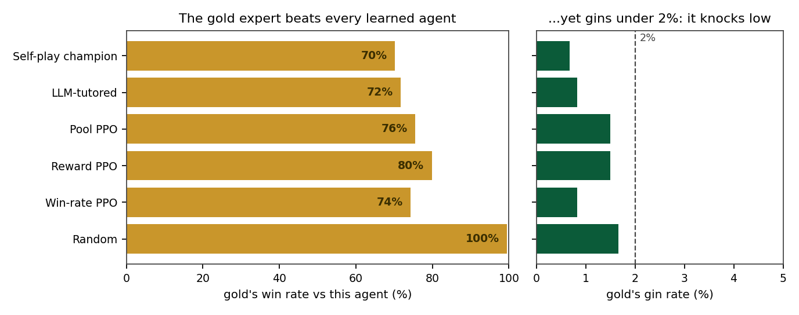
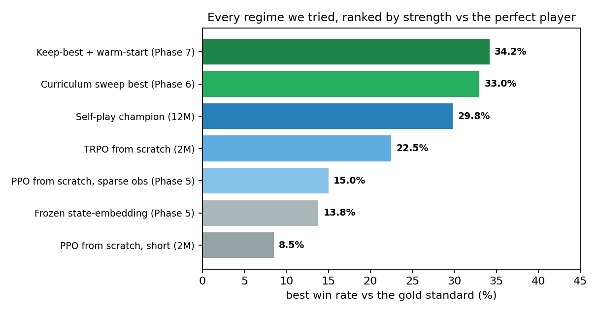
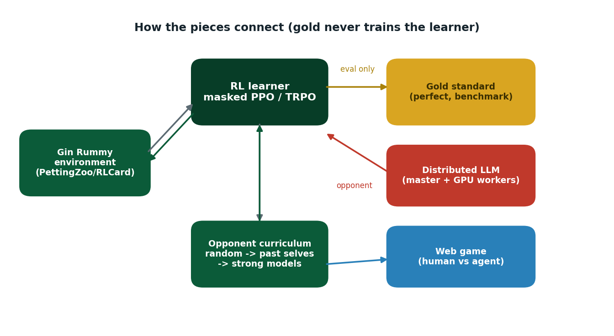

<h1 align="center">Adversarial Co-Evolution of RL and LLM Agents in Gin Rummy</h1>

<p align="center">
  <i>How close can a small, fast reinforcement-learning agent get to <b>perfect</b> Gin Rummy &mdash;<br/>
  and which training ideas actually make it stronger? We built the whole framework to find out.</i>
</p>

<p align="center">
  
  
  
  
  
</p>

<p align="center">
  &#128202; <b><a href="https://Nikelroid.github.io/adversarial-coevolution/">Full HTML report</a></b>
  &nbsp;&middot;&nbsp; &#128196; <b><a href="paper/main.pdf">PDF paper</a></b>
  &nbsp;&middot;&nbsp; &#127918; <b><a href="game/">Play the web game</a></b>
</p>

---

<div align="center">

<table align="center">
<tr>
  <td align="center"><b>34%</b><br/><sub>best agent vs the<br/>perfect player</sub></td>
  <td align="center"><b>&lt;2%</b><br/><sub>how often the perfect<br/>player gins</sub></td>
  <td align="center"><b>100+</b><br/><sub>controlled<br/>experiments</sub></td>
  <td align="center"><b>62&times;</b><br/><sub>faster LLM serving<br/>(scratch vs NFS)</sub></td>
</tr>
</table>

</div>

<p align="center">
  Gin Rummy needs both short-horizon arithmetic (counting <i>deadwood</i>) and long-horizon planning
  (forming <i>melds</i>), and you never see the opponent's hand. Training an RL agent hits the
  <b>opponent bottleneck</b>: it is only as good as who it practises against. So we built a fast RL
  player, a <b>provably optimal</b> opponent to grade everyone honestly, and a distributed system to
  put an LLM in the game &mdash; then ran 100+ experiments to see what truly helps.
</p>

<div align="center">
  
  <br/><sub>Our best agent climbed from the old champion's ~30% to <b>34%</b> against perfect play &mdash; through a systematic search, not luck.</sub>
</div>

---

<h2 align="center">The gold standard &mdash; and the surprise it revealed</h2>

<p align="center">
  We built a <b>perfect</b> Gin Rummy player (exact meld solving, no learning) to use as an honest
  yardstick. It beats every trained agent <b>70&ndash;99%</b> of the time. The surprise: it
  <b>gins under 2%</b> of games &mdash; it wins by <i>knocking early with low deadwood</i>, not by
  chasing gin. That single fact reframed every reward experiment we ran.
</p>

<div align="center">
  
</div>

---

<h2 align="center">Everything we tried, ranked vs the perfect player</h2>

<p align="center">
  We benchmarked nearly every reasonable way to make the agent stronger on one metric &mdash; win-rate
  against the perfect player &mdash; and, for each, found <i>why</i> it lands where it does.
</p>

<div align="center">
  
</div>

<div align="center">

<table align="center">
<tr><th>Idea</th><th>Verdict</th><th>Why</th></tr>
<tr><td>Keep the best checkpoint</td><td align="center">&#9989; helps</td><td>training drifts past its peak; saving the best recovers 2&ndash;3 pts for free</td></tr>
<tr><td>Warm-start from the champion</td><td align="center">&#9989; helps</td><td>start strong, then specialise</td></tr>
<tr><td>TRPO over PPO</td><td align="center">&#9989; helps</td><td>safer policy steps suit sparse, shifting self-play</td></tr>
<tr><td>Reward knocking, not gin</td><td align="center">&#9989; helps</td><td>copies the optimal low-risk style</td></tr>
<tr><td>Rising opponent curriculum</td><td align="center">&#9989; helps</td><td>always a fair-but-harder challenge</td></tr>
<tr><td>Paying 3&times; more for gin</td><td align="center">&#10134;&#65039; no effect</td><td>the agent refuses the bad habit at any bribe</td></tr>
<tr><td>Learned state embeddings</td><td align="center">&#10060; hurts</td><td>a frozen bottleneck discards useful detail</td></tr>
<tr><td>Imitation learning (DAgger)</td><td align="center">&#10060; fails</td><td>copies moves, not the reasoning behind them</td></tr>
<tr><td>Dense short-term rewards</td><td align="center">&#10060; fails</td><td>myopia &mdash; greedy for points, blind to winning</td></tr>
<tr><td>Live LLM-in-the-loop</td><td align="center">&#10060; infeasible</td><td>strong (beat our agent 3&ndash;2) but ~9&ndash;27&nbsp;s/move &mdash; far too slow</td></tr>
</table>

</div>

<p align="center">
  &#128161; <b>The clean result:</b> we tried to <i>bribe</i> the agent into ginning by paying three
  times more for a gin than a knock. Across 30 controlled runs it still gins under 1% of the time
  &mdash; just like the perfect player, it discovers that chasing gin loses. You cannot pay a policy
  into a bad habit.
</p>

---

<h2 align="center">The framework we built</h2>

<div align="center">
  
  <br/><sub>The gold standard is used for <b>scoring only</b> &mdash; it never trains the agent.</sub>
</div>

<p align="center">
  A single RL run fires tens of thousands of opponent queries; at 0.5&ndash;3&nbsp;s per 7B call a
  naive loop takes hours. We decouple inference from training with a master/worker stack:
</p>

<div align="center">

```
   env subprocess  ─▶  Master (CPU, FastAPI)  ─▶  suit-symmetry cache  ──(hit)──▶ return
   (per-step query)    Ollama-compatible API            │ miss
                              │ round-robin              ▼
              ┌───────────────┼───────────────┐
              ▼               ▼               ▼
          GPU worker      GPU worker  …   GPU worker      (1 GPU each, Qwen2.5-7B)
          self-registers in a shared-filesystem registry; master health-checks + balances
```

</div>

<p align="center">
  &#9888;&#65039; <b>Infra finding:</b> loading a 7B worker from home NFS runs at ~11&nbsp;MB/s
  (~28&nbsp;min &mdash; blows the health-check timeout). Staging weights on <b>scratch/BeeGFS cuts it
  to ~27&nbsp;s (62&times;)</b> &mdash; mandatory at scale (~32 queries/s with 14 workers).
</p>

---

<h2 align="center">It is a universal pipeline, not just a Gin Rummy script</h2>

<p align="center">
  The training pipeline is game-agnostic. Point it at <b>any</b> PettingZoo game, or your own
  environment, and it trains a masked PPO/TRPO agent through an opponent curriculum, keeps the best
  checkpoint, and grades it. The only thing that changes between games is the environment.
</p>

```python
from pettingzoo.classic import connect_four_v3
from coev import CoevConfig, train

# same pipeline that trained the Gin Rummy agents, now on Connect Four
train(CoevConfig(env_fn=connect_four_v3.env, env_id="connect_four",
                 algo="trpo", total_steps=2_000_000))
```

<p align="center">
  Add <code>seed_models</code> to give it prior agents to practise against, a
  <code>benchmark_agent</code> to grade against an expert, and a <code>reward_transform</code> to
  shape the reward. See <a href="coev/"><code>coev/</code></a> and
  <code>coev/examples/</code> (Connect Four and Gin Rummy).
</p>

---

<h2 align="center">Play the heroes &#127918;</h2>

<p align="center">
  A no-install browser game with a curated 5-rung ladder, easiest to perfect:
</p>

<div align="center">

<table align="center">
<tr><th>Opponent</th><th>Strength</th><th>What it is</th></tr>
<tr><td>&#127922; Rookie</td><td align="center">easiest</td><td>random legal moves &mdash; a warm-up</td></tr>
<tr><td>&#129302; Self-Play Champion</td><td align="center">strong</td><td>our earlier best (~30% vs gold)</td></tr>
<tr><td>&#127183; Curriculum Ace</td><td align="center">strongest</td><td>the final agent &mdash; <b>34%</b> vs the perfect player</td></tr>
<tr><td>&#128737;&#65039; League Tactician</td><td align="center">strongest</td><td>a close second (PFSP-trained)</td></tr>
<tr><td>&#127942; Gold Standard</td><td align="center">perfect</td><td>the hand-coded expert &mdash; the wall everyone hits</td></tr>
</table>

</div>

---

<h2 align="center">Repository layout</h2>

<div align="center">

<table align="center">
<tr><th>Path</th><th>What</th></tr>
<tr><td><code>coev/</code></td><td><b>the universal pipeline</b>: masked policy, opponent curriculum, and trainer for any PettingZoo AEC game (+ examples)</td></tr>
<tr><td><code>ppo_train.py</code>, <code>gym_wrapper.py</code></td><td>the original Gin-Rummy-specific masked PPO/TRPO policy + wrapper</td></tr>
<tr><td><code>agents/</code></td><td><code>GoldStandardAgent</code> (optimal benchmark), <code>PPOAgent</code> (masked-argmax), Random, LLM agents</td></tr>
<tr><td><code>sweep/</code></td><td>the experiment families: gold benchmark, algorithm (PPO vs TRPO), representation, the curriculum sweep + the keep-best/warm-start harness</td></tr>
<tr><td><code>llm/</code>, <code>slurm/</code></td><td>distributed LLM master/worker/cache + the SLURM jobs (incl. the self-sustaining sweep watchdog)</td></tr>
<tr><td><code>game/</code></td><td>zero-dependency human-vs-agent web client</td></tr>
<tr><td><code>paper/</code>, <code>docs/</code></td><td>the paper (<code>main.tex</code>), figure + report generators, and the full HTML report</td></tr>
</table>

</div>

---

<h2 align="center">Quickstart</h2>

```bash
# 0) Train on any game with the universal pipeline
python -m coev.examples.connect_four     # any PettingZoo game, no game-specific code
python -m coev.examples.gin_rummy        # same pipeline + a gold benchmark and reward shaping

# 1) Play the heroes (web game)
python game/server.py --host 127.0.0.1 --port 8000      # open http://127.0.0.1:8000

# 2) The gold-standard benchmark
python sweep/bench_gold.py

# 3) The final sweeps (SLURM array + self-sustaining watchdog)
python sweep/curriculum_configs.py && sbatch --array=0-29%10 slurm/curriculum.slurm
python sweep/phase7_configs.py    && sbatch --array=0-8%6 --export=ALL,CFG_DIR=phase7_cfgs slurm/curriculum.slurm

# 4) Regenerate every figure + the HTML report from saved JSON
python paper/make_figures.py && python paper/make_report_html.py
```

<p align="center">
  &#9888;&#65039; Load LLM worker weights from <b>scratch/BeeGFS</b>, not home NFS.
  Every figure regenerates from measured JSON results under <code>sweep/</code>.
</p>

---

<p align="center">
  <b>Nima Kelidari &middot; Mahdi Salmani &middot; Mohammadsaeed Haghi</b><br/>
  <sub>University of Southern California</sub>
</p>

<p align="center">
  <sub>Built on action-masked PPO/TRPO, PettingZoo/RLCard, Stable-Baselines3, and Qwen2.5.<br/>
  See the <a href="https://Nikelroid.github.io/adversarial-coevolution/">full report</a> for the whole story.</sub>
</p>
