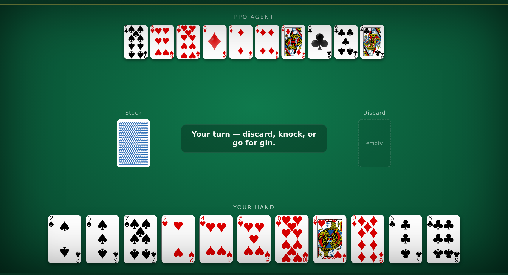
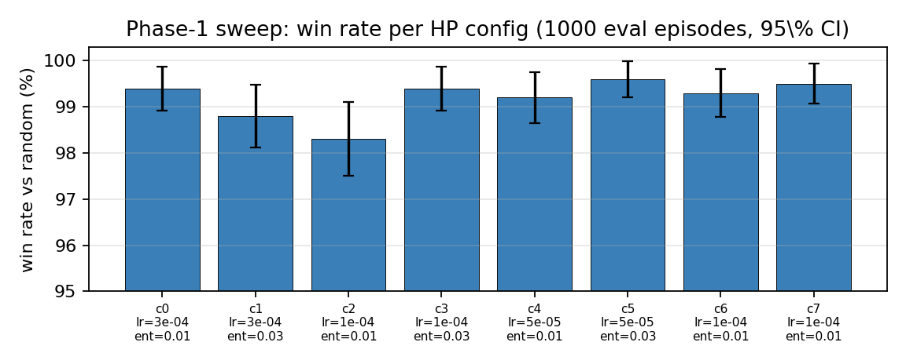
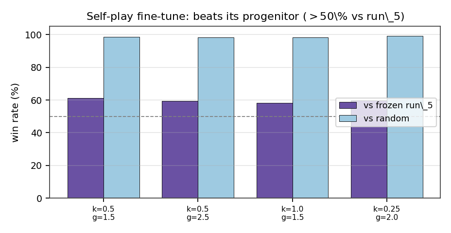
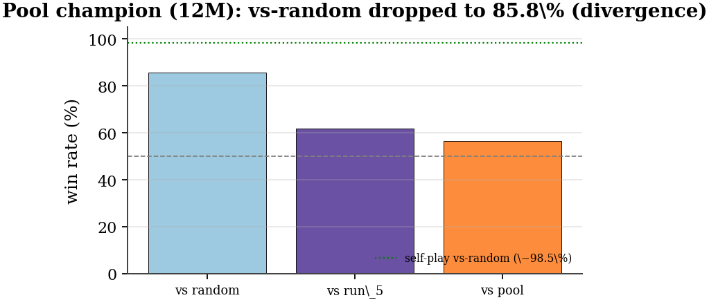
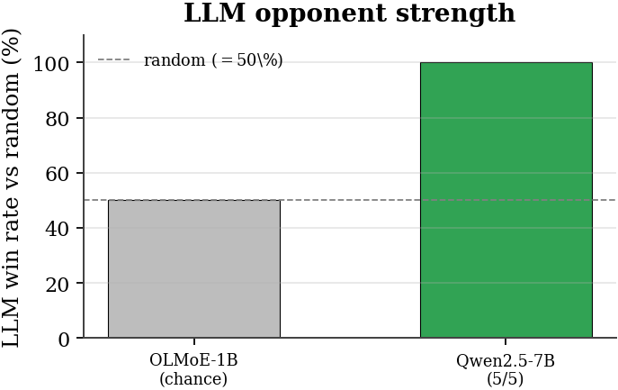
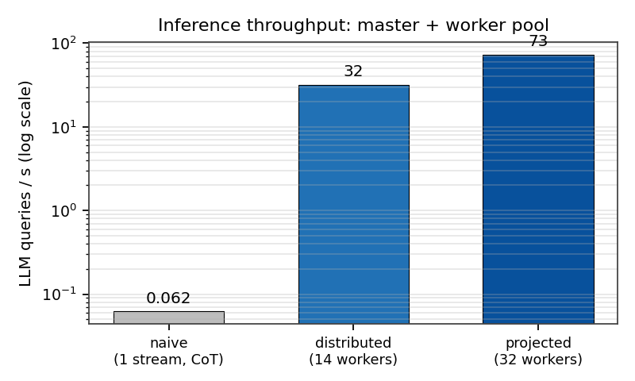

<h1 align="center">Adversarial Co-Evolution of RL and LLM Agents in Gin Rummy</h1>

<p align="center">
  <i>A hybrid system where a lightweight action-masked <b>PPO</b> agent and a strong-but-slow
  <b>LLM</b> opponent train against each other —<br/>without paying full LLM latency on every RL step.</i>
</p>

<p align="center">
  
  
  
  
  
</p>

<p align="center">
  📊 <b><a href="https://htmlpreview.github.io/?https://github.com/Nikelroid/adversarial-coevolution/blob/main/docs/index.html">Full HTML report</a></b>
  &nbsp;·&nbsp; 📄 <b><a href="paper/main.pdf">4-page PDF</a></b>
  &nbsp;·&nbsp; 🎮 <b><a href="game/">Play the web game</a></b>
</p>

---

<h2 align="center">Highlights</h2>

<div align="center">

<table align="center">
<tr>
  <td align="center"><b>99.6%</b><br/><sub>best PPO vs random</sub></td>
  <td align="center"><b>5 / 5</b><br/><sub>Qwen2.5-7B beats random</sub></td>
  <td align="center"><b>62×</b><br/><sub>faster worker load (scratch)</sub></td>
  <td align="center"><b>~32 q/s</b><br/><sub>LLM throughput, 14 workers</sub></td>
</tr>
</table>

</div>

<p align="center">
  Gin Rummy needs both short-horizon arithmetic (deadwood counting) and long-horizon planning
  (meld formation).<br/>Our three-phase roadmap:
  <b>(1)</b> train a strong RL backbone vs weak opponents →
  <b>(2)</b> train it vs an LLM opponent →
  <b>(3)</b> let them co-evolve.<br/>This repo covers <b>Phases&nbsp;1–2</b>.
</p>

<div align="center">
  
  <br/><sub><b>The human-vs-RL web client</b> — 3-D card animations, four trained opponents (debug view shown).</sub>
</div>

---

<h2 align="center">Phase 1 — the RL backbone saturates against random</h2>

<p align="center">
  Action-masked PPO (illegal-action logits → −∞) on PettingZoo <code>gin_rummy_v4</code>. An eight-config
  sweep (3×2 grid over learning rate × entropy, plus two ablations), 2M steps each, 96 parallel envs,
  evaluated over 1000 deterministic games.<br/><b>Every config lands in the 98.3–99.6% band</b> —
  statistically indistinguishable (95% CI ±0.6 pp). Mean reward sits at the <b>knock</b> value (0.5),
  not <b>gin</b> (1.5) — a risk/reward call only a <i>thinking</i> opponent can teach. That motivates Phase&nbsp;2.
</p>

<div align="center">
  
</div>

<div align="center">

<table align="center">
<tr><th>Config</th><th>win%</th><th>loss%</th><th>note</th></tr>
<tr><td>cfg5 · lr 5e-5, ent .03</td><td align="center"><b>99.6</b></td><td align="center">0.4</td><td>best of sweep</td></tr>
<tr><td>cfg7 · lr 1e-4, 10 epochs</td><td align="center">99.5</td><td align="center">0.5</td><td>ablation</td></tr>
<tr><td>cfg0 · lr 3e-4, ent .01</td><td align="center">99.4</td><td align="center">0.6</td><td>baseline</td></tr>
<tr><td>cfg3 · lr 1e-4, ent .03</td><td align="center">99.4</td><td align="center">0.6</td><td>—</td></tr>
<tr><td>cfg6 · lr 1e-4, n_steps 1024</td><td align="center">99.3</td><td align="center">0.7</td><td>ablation</td></tr>
<tr><td>cfg4 · lr 5e-5, ent .01</td><td align="center">99.2</td><td align="center">0.8</td><td>—</td></tr>
<tr><td>cfg1 · lr 3e-4, ent .03</td><td align="center">98.8</td><td align="center">1.2</td><td>—</td></tr>
<tr><td>cfg2 · lr 1e-4, ent .01</td><td align="center">98.3</td><td align="center">1.7</td><td>worst of sweep</td></tr>
</table>

</div>

---

<h2 align="center">Phase 2 — LLM-in-the-loop infrastructure</h2>

<p align="center">
  A single PPO rollout fires up to ~50k opponent queries; at 0.5–3 s per 7B call a naïve loop takes hours.
  We decouple inference from RL with a three-tier stack — workers self-register, the master load-balances
  and caches, the RL client speaks the unchanged Ollama API.
</p>

<div align="center">

```
   env subprocess  ─▶  Master (CPU, FastAPI)  ─▶  suit-symmetry cache  ──(hit)──▶ return
   (per-step query)    Ollama-compatible API            │ miss
                              │ round-robin              ▼
              ┌───────────────┼───────────────┐
              ▼               ▼               ▼
          HF worker       HF worker   …   HF worker      (1 GPU each, Qwen2.5-7B)
          self-registers in a shared-filesystem registry; master health-checks + balances
```

</div>

<div align="center">

<table align="center">
<tr>
  <td align="center"><br/><sub><b>Self-play</b> beats its progenitor</sub></td>
  <td align="center"><br/><sub><b>Pool</b> diverged after ~10M</sub></td>
</tr>
<tr>
  <td align="center"><br/><sub><b>Qwen2.5-7B</b> is competent; OLMoE isn't</sub></td>
  <td align="center"><br/><sub><b>Throughput</b> ~32 q/s, scales with pool</sub></td>
</tr>
</table>

</div>

<div align="center">

<table align="center">
<tr><th>Agent / opponent</th><th>vs</th><th>win%</th><th>loss%</th><th>note</th></tr>
<tr><td>Self-play (3M)</td><td>frozen run_5</td><td align="center"><b>61.1</b></td><td align="center">38.9</td><td>beats progenitor</td></tr>
<tr><td>Self-play (3M)</td><td>random</td><td align="center">98.7</td><td align="center">1.3</td><td>stays dominant</td></tr>
<tr><td>Pool champion (12M)</td><td>random</td><td align="center">85.8</td><td align="center">14.2</td><td>⚠️ diverged</td></tr>
<tr><td>OLMoE-1B opponent</td><td>random</td><td align="center">≈50</td><td align="center">—</td><td>plays at chance</td></tr>
<tr><td>Qwen2.5-7B opponent</td><td>random</td><td align="center"><b>100</b></td><td align="center">0</td><td>5/5 (small N)</td></tr>
</table>

</div>

<p align="center">
  💡 <b>Infra finding:</b> loading a 7B worker from home NFS runs at ~11 MB/s (~28 min — blows the
  health-check timeout). Staging weights on <b>scratch/BeeGFS cuts this to 27 s (62×)</b> — mandatory at scale.
</p>

---

<h2 align="center">First RL-vs-LLM run</h2>

<p align="center">
  PPO <b>warm-started from the self-play champion</b>, 64 env subprocesses, playing through the master against
  up to 32 Qwen2.5-7B workers (14 granted under the shared GPU quota — elastic).<br/>
  Ran <b>40k steps (~5 rollouts) in 17.5 min</b> at 39 env-steps/s; the terse prompt + 64-token cap dropped
  per-call latency from ~16 s to ~0.4 s.
</p>

<div align="center">

<table align="center">
<tr><th>Fine-tuned agent (40k steps)</th><th>vs</th><th>win%</th><th>loss%</th></tr>
<tr><td>LLM-finetuned PPO</td><td>random</td><td align="center"><b>98.2</b></td><td align="center">1.8</td></tr>
<tr><td>LLM-finetuned PPO</td><td>self-play champion</td><td align="center">45.4</td><td align="center">54.6</td></tr>
</table>

</div>

<p align="center">
  <b>Honest read:</b> the agent <i>retains</i> 98.2% vs random but sits at 45.4% vs the champion it started
  from — 40k steps (against 3M for self-play) is far too short to improve. This run validates the
  <b>pipeline</b> and confirms competence is retained; showing the LLM teacher actually <i>helps</i> is the
  <b>Phase-3</b> experiment (a much longer fine-tune to raise the gin rate, the headroom Phase 1 exposed).
</p>

---

<h2 align="center">Repository layout</h2>

<div align="center">

<table align="center">
<tr><th>Path</th><th>What</th></tr>
<tr><td><code>ppo_train.py</code>, <code>gym_wrapper.py</code></td><td>masked-PPO policy + single-agent wrapper over <code>gin_rummy_v4</code></td></tr>
<tr><td><code>sweep/</code></td><td>Phase-1 sweep, self-play, pool, and <code>llmplay_one.py</code> (RL-vs-LLM) training</td></tr>
<tr><td><code>llm/</code></td><td>master / worker / cache / discovery + <code>eval_opponent.py</code></td></tr>
<tr><td><code>agents/</code></td><td><code>RandomAgent</code>, <code>PPOAgent</code>, <code>LLMAgent</code>, <code>FastLLMAgent</code></td></tr>
<tr><td><code>slurm/</code></td><td>SLURM jobs: <code>master</code>, <code>worker</code> (array), <code>llm_train</code>, <code>llm_eval</code></td></tr>
<tr><td><code>game/</code></td><td>zero-dependency human-vs-RL web client (server + HTML/JS)</td></tr>
<tr><td><code>paper/</code></td><td>report (<code>main.tex</code> → <code>main.pdf</code>), figures, <code>make_figures.py</code>, <code>make_report_html.py</code></td></tr>
<tr><td><code>docs/</code></td><td><code>report.html</code> (full report), <code>llm_architecture.md</code></td></tr>
</table>

</div>

---

<h2 align="center">Quickstart</h2>

```bash
# 1) Play against the trained agent (web game)
python game/server.py --host 127.0.0.1 --port 8000      # open http://127.0.0.1:8000

# 2) Phase-1 sweep (SLURM, 64-core CPU node)
sbatch sweep/sweep.slurm

# 3) LLM opponent stack (SLURM): master + GPU worker pool
sbatch slurm/master.slurm
sbatch --array=0-31 --export=ALL,WORKER_PRESET=qwen2.5-7b,WORKER_MAXTOK=64 slurm/worker.slurm

# 4) RL-vs-LLM fine-tune (finds the master via runtime/master.json)
sbatch slurm/llm_train.slurm

# regenerate the report figures + HTML
python paper/make_figures.py && python paper/make_report_html.py
```

<p align="center">
  ⚠️ Load LLM worker weights from <b>scratch/BeeGFS</b> (<code>HF_HOME=/scratch.../hf_cache</code>), not home NFS.
</p>

---

<p align="center">
  <b>Nima Kelidari · Mahdi Salmani · Mohammadsaeed Haghi</b><br/>
  <sub>University of Southern California</sub>
</p>

<p align="center">
  <sub>Built on PPO + action masking, PettingZoo/RLCard, Stable-Baselines3, and Qwen2.5.<br/>
  Figures and reports regenerate from measured JSON results — see the
  <a href="docs/report.html">full report</a>.</sub>
</p>
